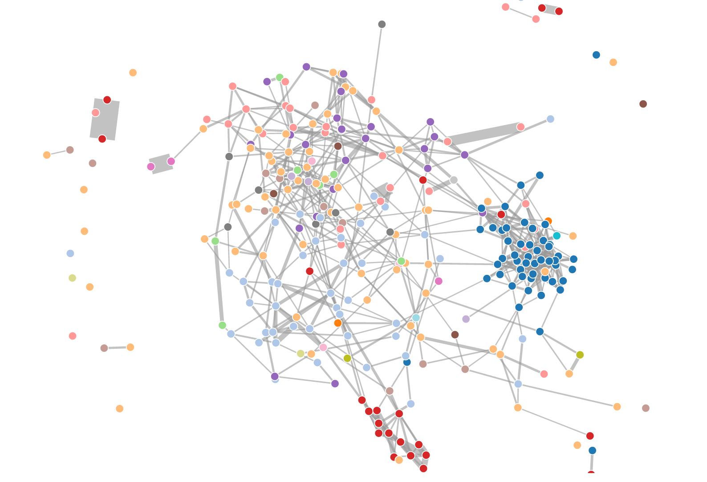
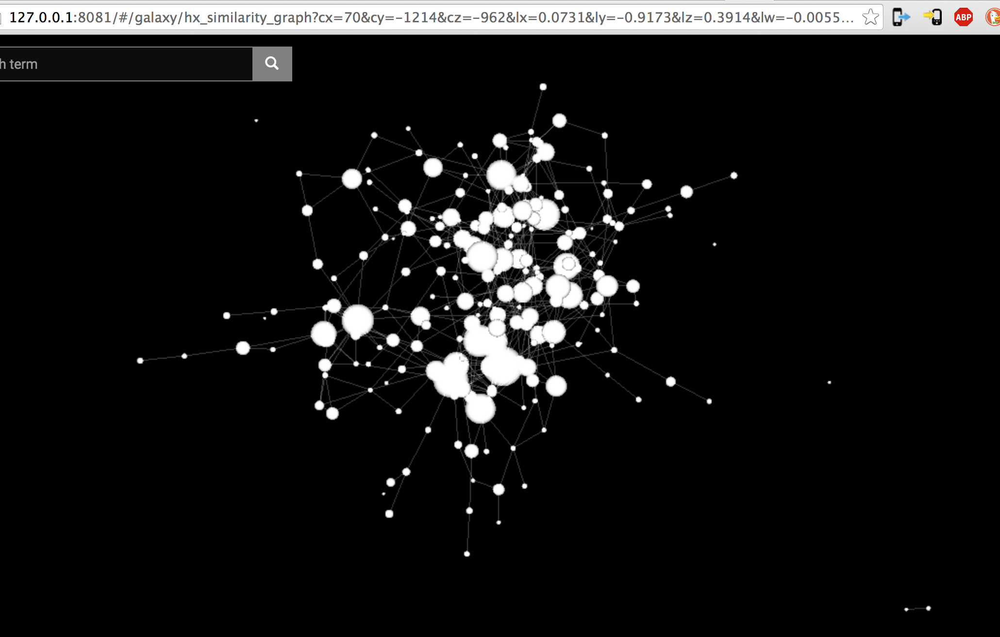

# Convert d3-compatible JSON graph to ngraph 3d layout

This repository contains tools for converting graphs that can be visualized with d3's force directed graph layout into a format that can be visualized in the style of the excellent [Code Galaxies project](http://anvaka.github.io/pm/)

Turn this:

Into this:


## To Run

`node mk_graph.js <input .json file path> <out path>`

For example:

`node mk_graph.js hx_similarity_graph.json hx_similarity_graph`

## Dependencies

```
npm install ngraph.graph
npm install ngraph.offline.layout
npm install ngraph.forcelayout3d
npm install ngraph.tobinary
```
